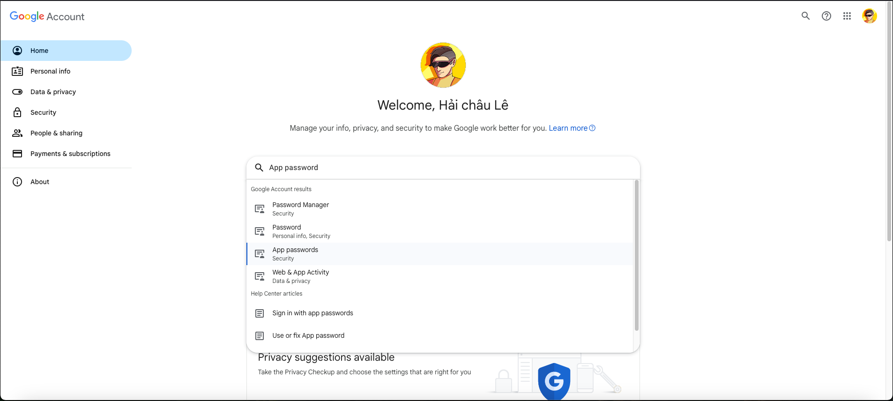
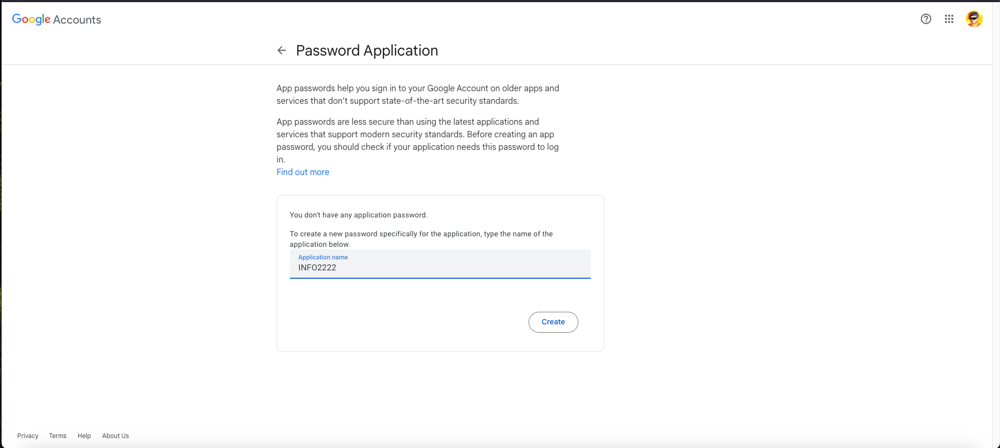
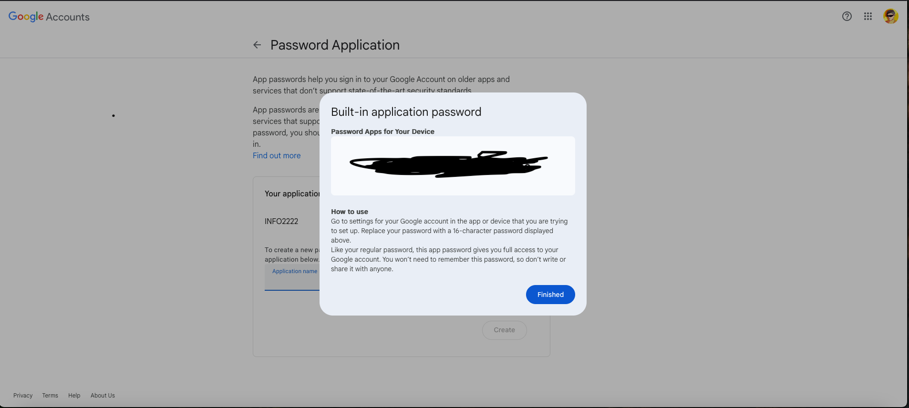

## 🐍 Backend Overview (FastAPI + MySQL)

### Folder Structure

```
backend/
├── controller/                  # Contains API endpoint definitions (routes)
├── dto/                         # Data Transfer Objects: defines structure of API requests and responses
│   ├── request/                 # Request DTOs – structures for incoming data
│   └── response/                # Response DTOs – structures for outgoing data
├── exception/                   # Handles custom error definitions and global exception handling
│   ├── app_exception.py         # Custom application-specific exceptions
│   ├── error_code.py            # Enum or constants for error codes
│   └── global_exception_handler.py  # Catches and handles exceptions globally in the app
├── middleware/                  # Middleware functions (e.g. authentication, logging)
├── model/                       # Database models / ORM schemas
├── repository/                  # Data access layer – handles interaction with the database
├── service/                     # Business logic layer – processes data before passing to controller
├── utils/                       # Utility functions used throughout the application
├── config.py                    # Centralized configuration for the application
├── database.py                  # Database connection setup and session management
├── main.py                      # Entry point of the FastAPI application
├── requirements.txt             # Lists Python dependencies required to run the backend
├── settings.yaml                # Environment-specific settings (e.g., DB credentials, secrets)
```

### Requirements

- Python 3.13
- MySQL
- virtualenv

### Setup Instructions

```bash
cd backend
# 👉 Move into the backend project directory

virtualenv venv --python=python3.13
# 🐍 Create a new virtual environment named "env_chatapp" using Python 3.13 interpreter

source venv/bin/activate
# 🔄 Activate the virtual environment so Python & pip use the isolated environment

pip install -r requirements.txt
# 📦 Install all required Python dependencies listed in requirements.txt
```

### Email Configuration (Google SMTP)
- Use Google’s SMTP service to send emails
- Make sure your Google account has 2-Step Verification enabled
- Search for “App Passwords” in your Google account settings
  
- Create a new app password, then copy and paste it into the APP_EMAIL -> PASSWORD section of your settings.yaml file
  
- copy the hidden text that I am trying to hide it
  
  Create an App Password in your Google Account settings and configure `settings.yaml`:

```yaml
DATABASE:
  MYSQL:
    HOST: "localhost"
    PORT: "3306"
    USERNAME: "root"
    PASSWORD: "Binchamchihocgioi"
    DATABASE: "e2ee_sheets"


AUTHENTICATION:
  ALGORITHM: "HS256"
  SECRET_KEY_LOGIN: high_distinction_100
  ACCESS_TOKEN_EXPIRE_MINUTES_LOGIN: 300
  SECRET_KEY_EMAIL_VERIFICATION: high_distinction_100
  ACCESS_TOKEN_EXPIRE_MINUTES_EMAIL_VERIFICATION: 5
  SECRET_KEY_2FA_VERIFICATION: high_distinction_100
  ACCESS_TOKEN_EXPIRE_MINUTES_2FA_VERIFICATION: 5


GOOGLE_AUTHENTICATION:
  CLIENT_ID: 
  CLIENT_SECRET: 


APP_EMAIL:
  SENDER: "haichau.hvsg@gmail.com"
  PASSWORD: 
  SMTP_SERVER: "smtp.gmail.com"
  SMTP_PORT: 587


APP_GENERAL:
  APP_NAME: "E2EE Google Sheets"


WEB:
  FRONTEND:
    DOMAIN: "http://localhost:3000"
  BACKEND:
    DOMAIN: "http://localhost:9990"
```

### Running the Server

```bash
python main.py
```

---

